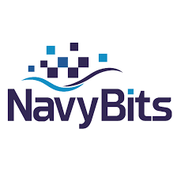

# 🎲 **Sudoku Game Application**




---

## 🌟 **About the Project**

This project is a feature-rich **Sudoku Game** built as part of an application for the Navy Bits internship program. It is designed to offer an engaging Sudoku experience with an intuitive interface and a focus on **algorithmic excellence**.  
Key Features:
- 🔹 Interactive Sudoku board with real-time validation.
- 🔹 Puzzle generation ensuring **unique and solvable puzzles**.
- 🔹 Hint and solve functionalities powered by **backtracking algorithms**.
- 🔹 Persistent storage of game state using **local storage**.
- 🔹 Elegant and user-friendly design with audio feedback.

---

## 📸 **Screenshots**

| **Game Interface** | **Success Modal** |  
|---------------------|-------------------|  
|  |  |  

---

## 🛠️ **Technologies Used**

- **Frontend**: React.js, TypeScript  
- **State Management**: React hooks (`useState`, `useEffect`)  
- **Algorithmic Features**:  
  - **Puzzle Generation**: Backtracking algorithm to ensure solvability.  
  - **Hint & Solve**: Leveraged recursive algorithms for validation and solution.  
- **Notifications**: `react-toastify` for dynamic notifications.  
- **Audio Feedback**: Playful sound effects for actions like hints, invalid moves, and successful puzzle completion.

---

## ⚙️ **How It Works**

### 1. **Puzzle Generation**
- Utilizes backtracking to create puzzles with a single unique solution.  
- The difficulty level adjusts the number of pre-filled cells (`easy`, `medium`, `hard`).  

### 2. **Hint & Solve Functionality**
- Hints provide the next possible valid number for a specific cell.  
- Solve completes the entire board while maintaining Sudoku rules.

### 3. **Game State Persistence**
- The current board and difficulty level are saved in **local storage**, allowing players to continue from where they left off.

---

## 🧩 **Features**

| Feature              | Description                                                    |  
|----------------------|----------------------------------------------------------------|  
| 🎮 **Interactive Play** | Real-time board updates with valid number checks.            |  
| 🧠 **Hints**           | Get a single valid move based on the current board state.     |  
| 🛠️ **Solve Button**    | Completes the puzzle automatically using a backtracking approach. |  
| 🔄 **Reset Game**      | Clear the board and start new board.                              |  
| 📂 **Image Upload**    | Upload an image of a Sudoku puzzle and start solving it.      |  

---

## 🎯 **How to Run the Project**

1. Clone the repository:  
   ```bash
   git clone https://github.com/your-username/sudoku-game
   cd sudoku-game
   ```
2. Install dependencies:  
   ```bash
   npm install
   ```
3. Start the development server:  
   ```bash
   npm start
   ```
4. Open your browser and navigate to `http://localhost:3000`.

---

## 📈 **Challenges and Solutions**

### 🔹 Challenge: **Ensuring unique puzzle generation.**  
**Solution:** Implemented a backtracking algorithm to generate puzzles with a guaranteed solution. Fine-tuned the cell removal process based on difficulty levels.

### 🔹 Challenge: **Managing game state across sessions.**  
**Solution:** Utilized local storage to persist the board and difficulty settings, ensuring a seamless user experience.

---

## 🏆 **Future Enhancements**

- Add multiplayer Sudoku challenges.  
- Implement daily puzzles with leaderboards.  
- Enhance the image recognition for uploaded Sudoku puzzles.  

---

## 💡 **Why This Project?**

This project highlights my ability to:
- Design interactive web applications with a clean user interface.  
- Solve algorithmic challenges using efficient data structures and techniques.  
- Work with persistent storage and handle user feedback dynamically.

---

## 🤝 **Acknowledgments**

Special thanks to **Navy Bits** for this incredible opportunity!  

---

## 📄 **License**

This project is licensed under the MIT License - see the [LICENSE](LICENSE) file for details.

---
